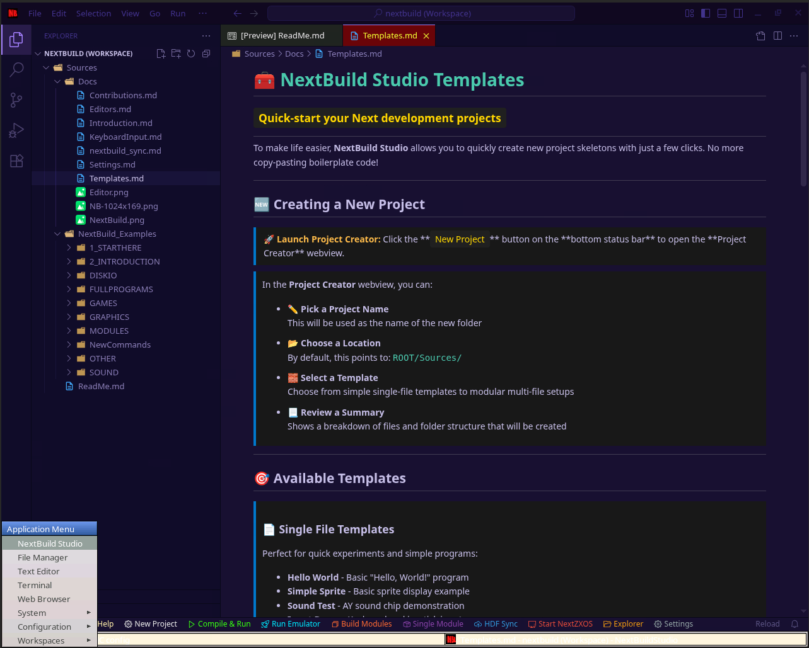

# nextbuildstudio_template

NextBuild Studio template using a dev container.

## Prequisites

* Visual Studio Code
* Docker (WSL2 required for Windows users)
* Remote Containers extension for VS Code

## Running

1. Clone the repo.
2. Open the folder.
3. Select "Reopen in container" when prompted.
4. Visit the running desktop on <http://localhost:6080> or connect via VNC port 5901.

NextBuild Studio is available from the menu (or terminal `nextbuildstudio`). First run will configure the instance.

## CSpect

CSpect is not installed by default and has to be installed manually. This can be achieved by unzipping the CSpect .zip file into `~/Documents/NextBuildv9/Emu/CSpect/`.

`Compile & Run` from the editor will build a `.nex` file in its folder structure for use by the emulator.
